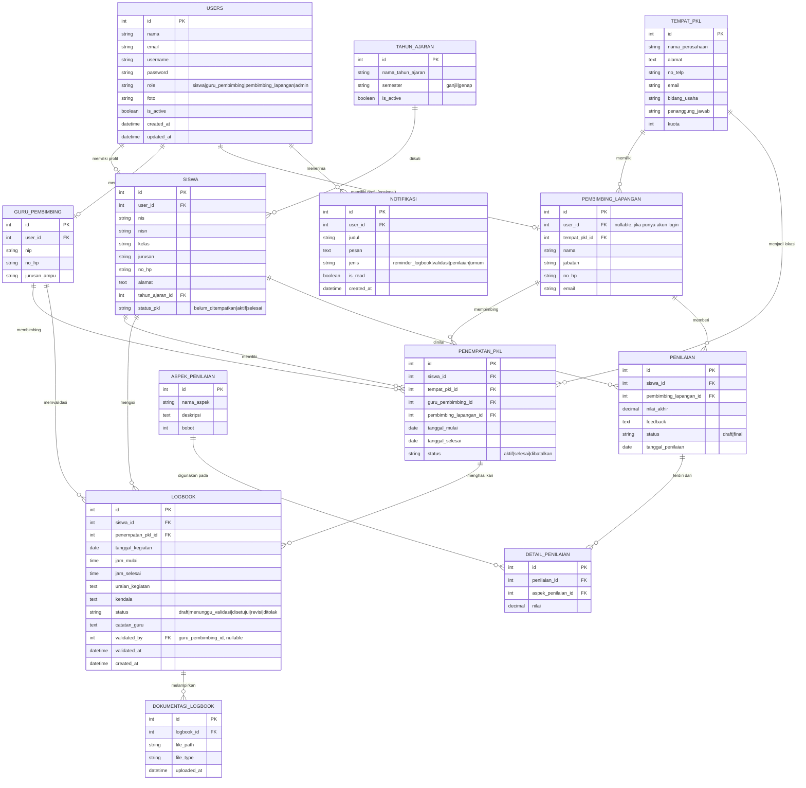

## 5. Entity Relationship Diagram (ERD)

### Catatan Bisnis Rule Penting (untuk implementasi Model/Validasi)

- Satu siswa hanya boleh punya **satu penempatan PKL berstatus `aktif`** dalam satu waktu.
- Logbook wajib terkait ke `penempatan_pkl` yang sedang aktif — cegah siswa mengisi logbook jika belum ditempatkan.
- `penilaian` yang sudah berstatus `final` tidak boleh diedit lagi (kunci form di controller & tambahkan konfirmasi di UI).
- Penamaan tabel database disarankan snake_case & lowercase, contoh: `users`, `siswa`, `tempat_pkl`, `penempatan_pkl`, `logbook`, `dokumentasi_logbook`, `aspek_penilaian`, `penilaian`, `detail_penilaian`, `notifikasi`, `tahun_ajaran`.

---
