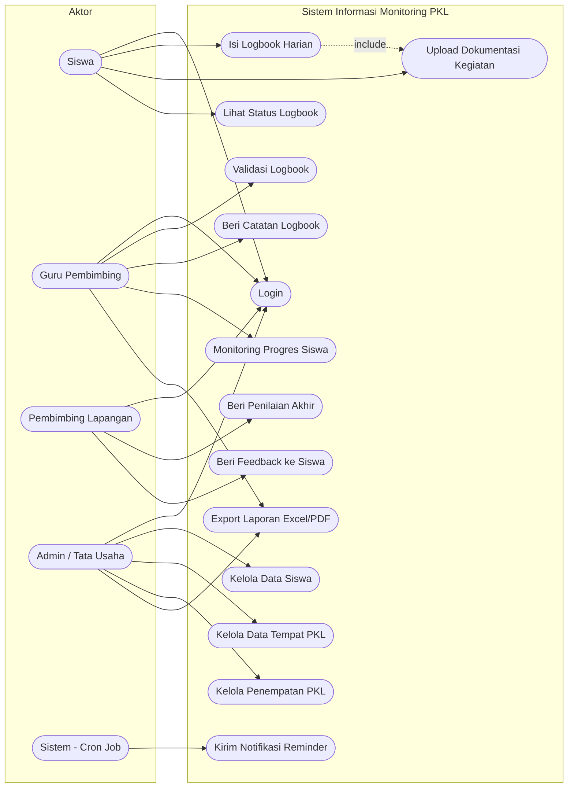

## 6. Use Case Diagram

**Aktor:** Siswa, Guru Pembimbing, Pembimbing Lapangan, Admin/Tata Usaha, Sistem (cron job otomatis)

### Deskripsi Use Case

| Kode  | Use Case                    | Aktor                  | Deskripsi Singkat                                            |
| ----- | --------------------------- | ---------------------- | ------------------------------------------------------------ |
| UC-01 | Login                       | Semua role             | Autentikasi & redirect ke dashboard sesuai role              |
| UC-02 | Isi Logbook Harian          | Siswa                  | Mengisi laporan aktivitas PKL harian                         |
| UC-03 | Upload Dokumentasi Kegiatan | Siswa                  | Melampirkan foto/dokumen bukti kegiatan (include dari UC-02) |
| UC-04 | Lihat Status Logbook        | Siswa                  | Melihat status persetujuan logbook yang diajukan             |
| UC-05 | Validasi Logbook            | Guru Pembimbing        | Menyetujui/menolak/meminta revisi logbook siswa              |
| UC-06 | Beri Catatan Logbook        | Guru Pembimbing        | Memberi catatan/masukan pada logbook siswa                   |
| UC-07 | Monitoring Progres Siswa    | Guru Pembimbing        | Melihat dashboard rekap progres siswa bimbingan              |
| UC-08 | Beri Penilaian Akhir        | Pembimbing Lapangan    | Mengisi form penilaian per aspek + nilai akhir               |
| UC-09 | Beri Feedback ke Siswa      | Pembimbing Lapangan    | Memberi catatan kualitatif ke siswa                          |
| UC-10 | Kelola Data Siswa           | Admin                  | CRUD data induk siswa PKL                                    |
| UC-11 | Kelola Data Tempat PKL      | Admin                  | CRUD data DU/DI                                              |
| UC-12 | Kelola Penempatan PKL       | Admin                  | Assign siswa ke tempat PKL + pembimbing                      |
| UC-13 | Export Laporan              | Guru Pembimbing, Admin | Unduh laporan monitoring/sebaran siswa (Excel/PDF)           |
| UC-14 | Kirim Notifikasi Reminder   | Sistem (otomatis)      | Kirim email jika siswa belum isi logbook dalam X hari        |

---
