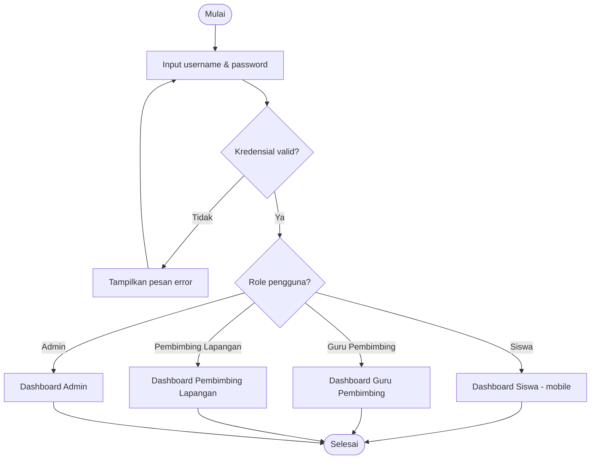
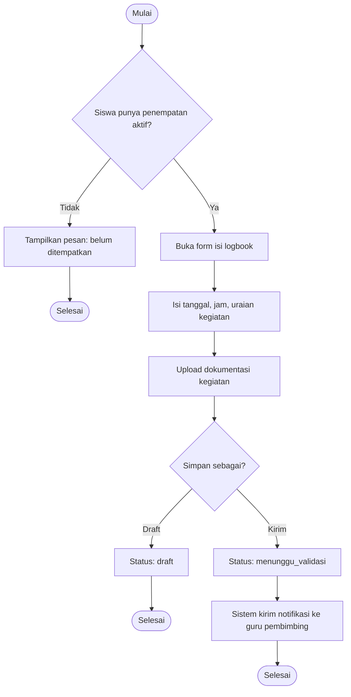
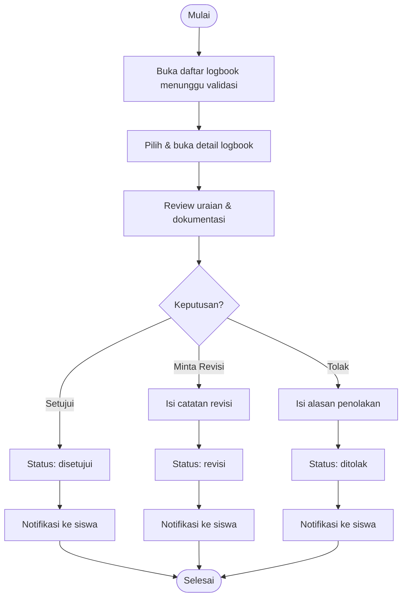
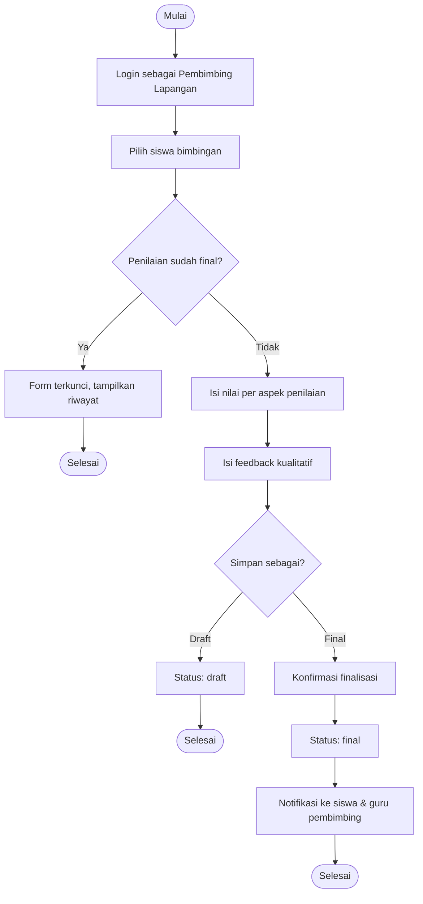
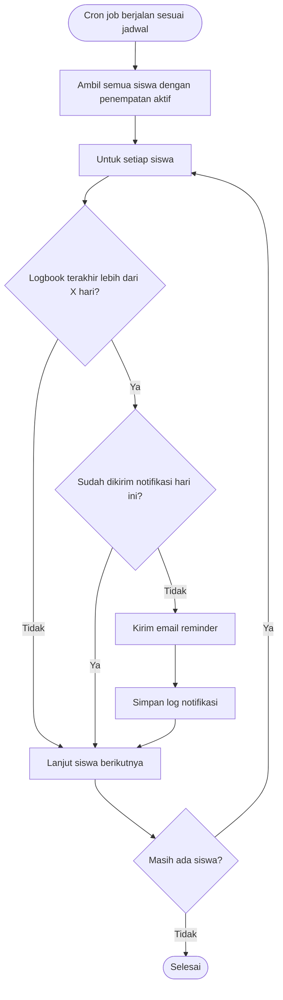
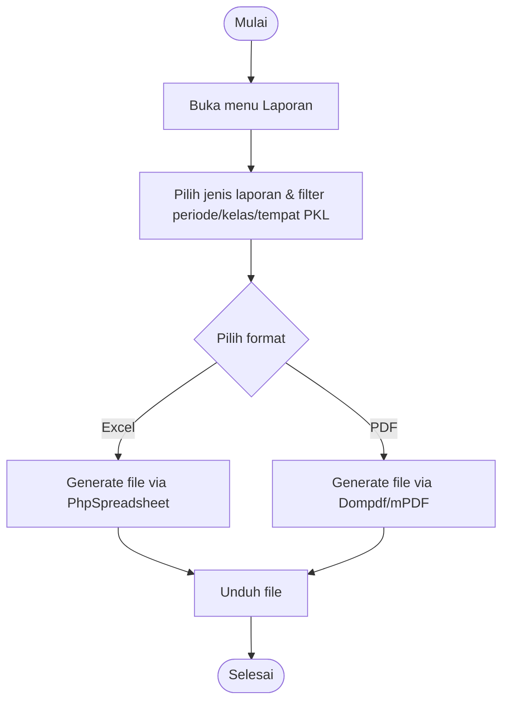

## 7. Activity Diagram

### 7.1 Login & Redirect Berdasarkan Role

### 7.2 Pengisian Logbook oleh Siswa

### 7.3 Validasi Logbook oleh Guru Pembimbing

### 7.4 Penilaian Akhir oleh Pembimbing Lapangan

### 7.5 Notifikasi Otomatis (Reminder Logbook)

### 7.6 Ekspor Laporan

---
