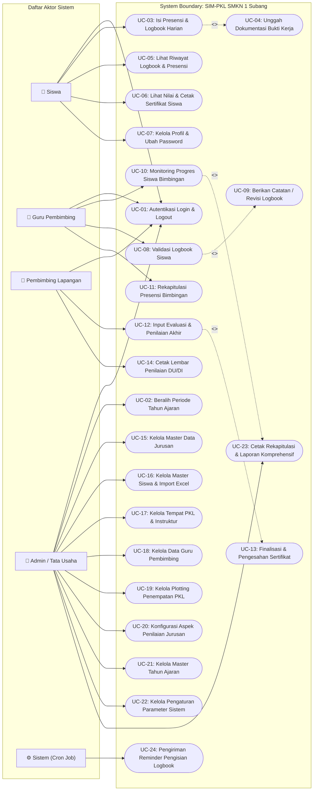
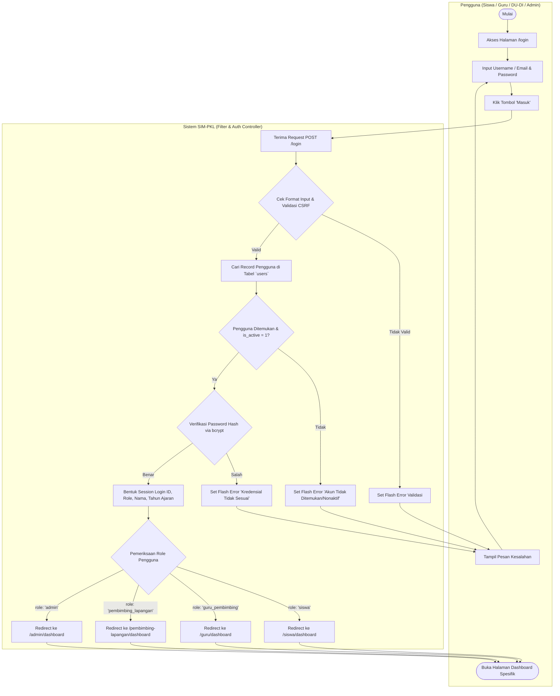
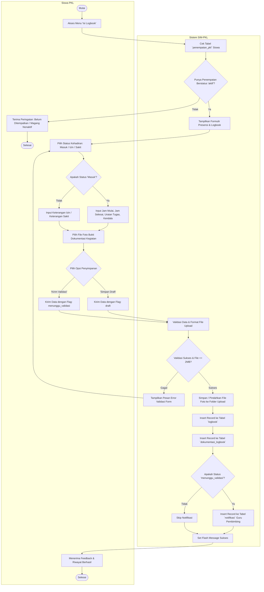
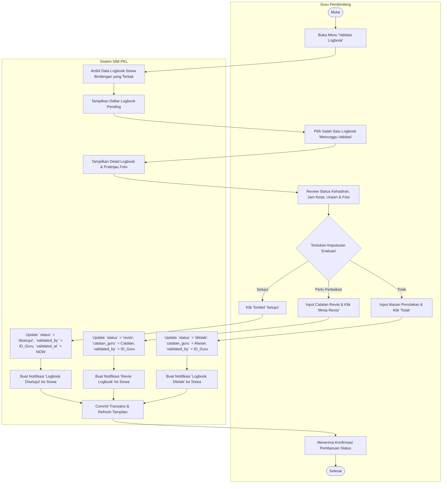
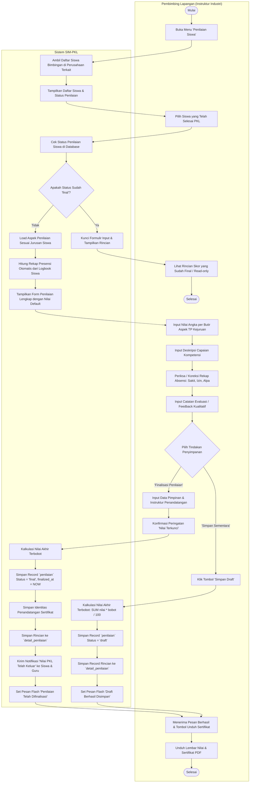
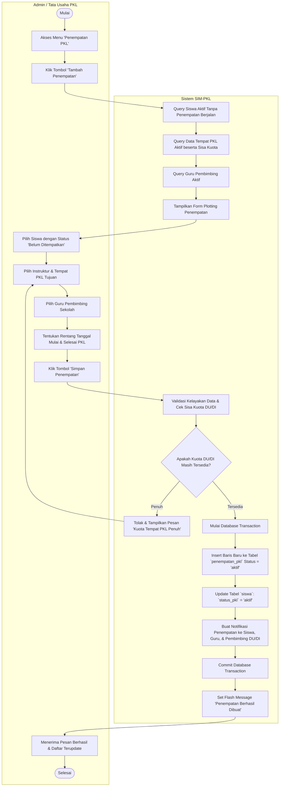
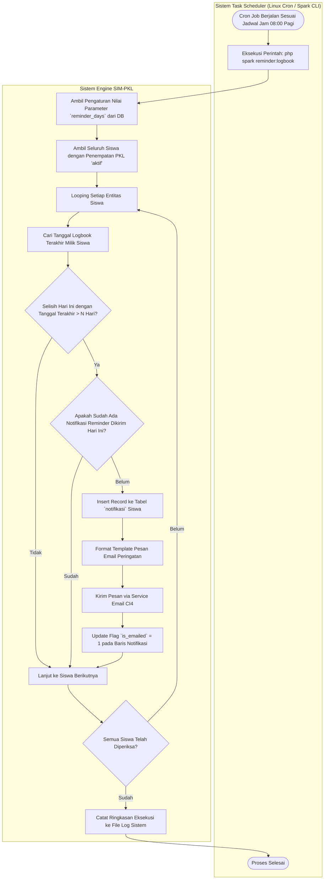
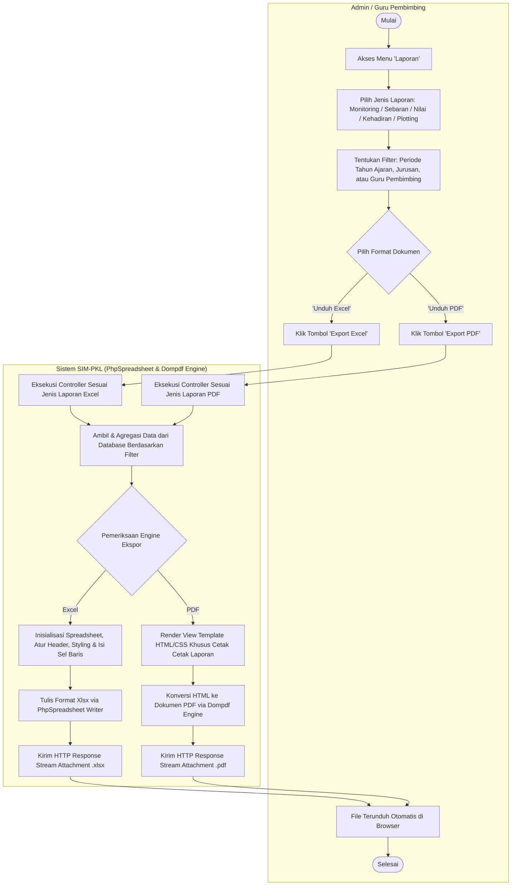

# DOKUMEN PERANCANGAN SISTEM INFORMASI MONITORING PKL (SIM-PKL)
**SMKN 1 SUBANG**

---

## DAFTAR ISI
1. [PENDAHULUAN](#1-pendahuluan)
   - 1.1 Profil Sistem
   - 1.2 Tech Stack
   - 1.3 Aktor & Hak Akses
2. [BAGIAN 1: ENTITY RELATIONSHIP DIAGRAM (ERD) — KONDISI RIIL SEKARANG](#2-bagian-1-entity-relationship-diagram-erd--kondisi-riil-sekarang)
   - 2.1 Diagram ERD (Mermaid)
   - 2.2 Kamus Data / Skema Struktur Tabel (15 Tabel)
   - 2.3 Aturan Relasi, Integritas Referensial & Constraint
   - 2.4 Business Rules Database
3. [BAGIAN 2: USE CASE DIAGRAM (FORMAT UML)](#3-bagian-2-use-case-diagram-format-uml)
   - 3.1 Identifikasi Aktor & Batasan Sistem (System Boundary)
   - 3.2 Diagram Use Case UML Global
   - 3.3 Diagram Use Case per Modul / Aktor
   - 3.4 Relasi `<<include>>` dan `<<extend>>`
   - 3.5 Tabel Spesifikasi Skenario Use Case
4. [BAGIAN 3: ACTIVITY DIAGRAM (FORMAT UML)](#4-bagian-3-activity-diagram-format-uml)
   - 4.1 Activity Diagram: Autentikasi & Role-Based Routing
   - 4.2 Activity Diagram: Pengisian Presensi & Logbook Siswa
   - 4.3 Activity Diagram: Validasi Logbook oleh Guru Pembimbing
   - 4.4 Activity Diagram: Input Penilaian Akhir oleh Pembimbing Lapangan
   - 4.5 Activity Diagram: Plotting & Penempatan PKL Siswa (Admin)
   - 4.6 Activity Diagram: Pengiriman Notifikasi & Reminder Otomatis (Cron Job)
   - 4.7 Activity Diagram: Ekspor Laporan & Rekapitulasi Monitoring

---

## 1. PENDAHULUAN

### 1.1 Profil Sistem
**SIM-PKL (Sistem Informasi Monitoring PKL)** SMKN 1 Subang merupakan platform terpadu berbasis web yang dirancang untuk mengelola, memantau, dan mendokumentasikan seluruh tahapan Praktik Kerja Lapangan (PKL) siswa Sekolah Menengah Kejuruan. Sistem ini menggantikan sistem jurnal manual kertas menjadi sistem digital terintegrasi yang mencakup manajemen penempatan, presensi harian, jurnal kegiatan (logbook), verifikasi berjenjang oleh guru pembimbing, penilaian berkala dan akhir oleh pembimbing industri (DU/DI), hingga pencetakan sertifikat dan rekapitulasi laporan berkala.

### 1.2 Tech Stack
- **Bahasa & Framework:** PHP 8.2+ / CodeIgniter 4.7
- **Database:** MySQL / MariaDB (Engine InnoDB)
- **Frontend:** Bootstrap 5.3 (Self-hosted), Inter Font (Self-hosted), Chart.js 4.4
- **Modul Ekspor:** PhpSpreadsheet (Excel .xlsx), Dompdf (Dokumen PDF)
- **Autentikasi & Otorisasi:** Session-based RBAC (Role-Based Access Control) dengan CI4 Filters

### 1.3 Aktor & Hak Akses
1. **Admin / Tata Usaha:** Mengelola seluruh data master (tahun ajaran, jurusan, tempat PKL, pembimbing lapangan, guru pembimbing, siswa), manajemen penempatan (plotting), kustomisasi aspek penilaian per jurusan, pengaturan sistem, serta cetak laporan komprehensif.
2. **Guru Pembimbing:** Memantau progres siswa bimbingan, memverifikasi (setuju / revisi / tolak) logbook dan presensi harian, melihat rekapitulasi kehadiran, serta mencetak laporan bimbingan.
3. **Pembimbing Lapangan (Instruktur DU/DI):** Memantau aktivitas siswa di tempat magang, memberikan penilaian akhir berdasarkan aspek teknis/non-teknis per jurusan, mencatat absensi fisik (sakit/izin/alpa), memberikan feedback kualitatif, serta mengesahkan lembar sertifikat/nilai.
4. **Siswa:** Mengisi logbook kegiatan harian, mencatat status kehadiran (masuk/izin/sakit), melampirkan dokumentasi kegiatan kerja, memantau status validasi, melihat rekap nilai & presensi, mengunduh lembar nilai PDF, serta mengelola profil pribadi.
5. **Sistem (Cron Job):** Mengeksekusi tugas otomatis di latar belakang seperti pengiriman email reminder jika siswa belum mengisi logbook dalam jangka waktu tertentu.

---

## 2. BAGIAN 1: ENTITY RELATIONSHIP DIAGRAM (ERD) — KONDISI RIIL SEKARANG

Kondisi riil database saat ini terdiri dari **15 tabel** yang mencakup penambahan fitur terbaru seperti:
- Tabel `jurusan` master data untuk kurikulum SMK.
- Field `status_kehadiran` (`masuk`, `izin`, `sakit`) dan nullable `jam_mulai`/`jam_selesai` pada tabel `logbook`.
- Field `jurusan` dan `urutan` pada tabel `aspek_penilaian` untuk penilaian spesifik keahlian (TP/Tujuan Pembelajaran).
- Field `deskripsi` pada tabel `detail_penilaian`.
- Field rekapitulasi `sakit`, `izin`, `tanpa_keterangan`, serta identitas penandatangan sertifikat (`pimpinan_nama`, `pimpinan_nip`, `instruktur_nama`, `instruktur_nip`) pada tabel `penilaian`.
- Tabel `pengaturan` untuk parameter dinamis aplikasi.

### 2.1 Diagram ERD (Mermaid)

```mermaid
erDiagram
    USERS ||--o| SISWA : "memiliki relasi profil 1:1"
    USERS ||--o| GURU_PEMBIMBING : "memiliki relasi profil 1:1"
    USERS ||--o| PEMBIMBING_LAPANGAN : "memiliki akun login (opsional 1:1)"
    USERS ||--o{ NOTIFIKASI : "menerima pesan notifikasi"

    TAHUN_AJARAN ||--o{ SISWA : "mengelompokkan periode siswa"
    JURUSAN ||--o{ SISWA : "dirujuk secara logis oleh"
    JURUSAN ||--o{ ASPEK_PENILAIAN : "memiliki aspek kustom per jurusan"

    TEMPAT_PKL ||--o{ PEMBIMBING_LAPANGAN : "menaungi instruktur industri"
    TEMPAT_PKL ||--o{ PENEMPATAN_PKL : "menjadi lokasi magang"

    SISWA ||--o{ PENEMPATAN_PKL : "ditempatkan pada"
    GURU_PEMBIMBING ||--o{ PENEMPATAN_PKL : "membimbing akademik"
    PEMBIMBING_LAPANGAN ||--o{ PENEMPATAN_PKL : "membimbing teknis industri"

    PENEMPATAN_PKL ||--o{ LOGBOOK : "menghasilkan rekam aktivitas"
    SISWA ||--o{ LOGBOOK : "menulis logbook harian"
    GURU_PEMBIMBING ||--o{ LOGBOOK : "memvalidasi logbook"
    LOGBOOK ||--o{ DOKUMENTASI_LOGBOOK : "melampirkan file bukti"

    SISWA ||--o| PENILAIAN : "menerima evaluasi akhir (1:1)"
    PEMBIMBING_LAPANGAN ||--o{ PENILAIAN : "memberikan penilaian"
    PENILAIAN ||--o{ DETAIL_PENILAIAN : "memuat rincian skor"
    ASPEK_PENILAIAN ||--o{ DETAIL_PENILAIAN : "menjadi rubrik evaluasi"

    USERS {
        int id PK "UNSIGNED AUTO_INCREMENT"
        varchar nama "VARCHAR(100)"
        varchar email "VARCHAR(150) UNIQUE"
        varchar username "VARCHAR(50) UNIQUE"
        varchar password "VARCHAR(255)"
        enum role "siswa | guru_pembimbing | pembimbing_lapangan | admin"
        varchar foto "VARCHAR(255) NULL"
        tinyint is_active "TINYINT(1) DEFAULT 1"
        datetime created_at "NULL"
        datetime updated_at "NULL"
    }

    TAHUN_AJARAN {
        int id PK "UNSIGNED AUTO_INCREMENT"
        varchar nama_tahun_ajaran "VARCHAR(20)"
        enum semester "ganjil | genap"
        date tanggal_mulai "NULL"
        date tanggal_selesai "NULL"
        tinyint is_active "TINYINT(1) DEFAULT 0"
        datetime created_at "NULL"
        datetime updated_at "NULL"
    }

    JURUSAN {
        int id PK "UNSIGNED AUTO_INCREMENT"
        varchar kode "VARCHAR(20) UNIQUE"
        varchar nama "VARCHAR(100)"
        varchar bidang_keahlian "VARCHAR(150) NULL"
        varchar program_keahlian "VARCHAR(150) NULL"
        varchar konsentrasi_keahlian "VARCHAR(150) NULL"
        varchar kepala_program "VARCHAR(100) NULL"
        varchar nip_kepala_program "VARCHAR(50) NULL"
        text deskripsi "TEXT NULL"
        tinyint is_active "TINYINT(1) DEFAULT 1"
        datetime created_at "NULL"
        datetime updated_at "NULL"
    }

    SISWA {
        int id PK "UNSIGNED AUTO_INCREMENT"
        int user_id FK "UNSIGNED UNIQUE -> users.id"
        varchar nis "VARCHAR(20) UNIQUE"
        varchar nisn "VARCHAR(20) NULL"
        varchar kelas "VARCHAR(20)"
        varchar jurusan "VARCHAR(50)"
        varchar no_hp "VARCHAR(20) NULL"
        text alamat "TEXT NULL"
        int tahun_ajaran_id FK "UNSIGNED NULL -> tahun_ajaran.id"
        enum status_pkl "belum_ditempatkan | aktif | selesai"
        datetime created_at "NULL"
        datetime updated_at "NULL"
    }

    GURU_PEMBIMBING {
        int id PK "UNSIGNED AUTO_INCREMENT"
        int user_id FK "UNSIGNED UNIQUE -> users.id"
        varchar nip "VARCHAR(30) NULL"
        varchar no_hp "VARCHAR(20) NULL"
        varchar jurusan_ampu "VARCHAR(100) NULL"
        datetime created_at "NULL"
        datetime updated_at "NULL"
    }

    TEMPAT_PKL {
        int id PK "UNSIGNED AUTO_INCREMENT"
        varchar nama_perusahaan "VARCHAR(150)"
        text alamat "TEXT"
        varchar no_telp "VARCHAR(20) NULL"
        varchar email "VARCHAR(150) NULL"
        varchar bidang_usaha "VARCHAR(100) NULL"
        varchar penanggung_jawab "VARCHAR(100) NULL"
        int kuota "INT(11) DEFAULT 0"
        tinyint is_active "TINYINT(1) DEFAULT 1"
        datetime created_at "NULL"
        datetime updated_at "NULL"
    }

    PEMBIMBING_LAPANGAN {
        int id PK "UNSIGNED AUTO_INCREMENT"
        int user_id FK "UNSIGNED NULL UNIQUE -> users.id"
        int tempat_pkl_id FK "UNSIGNED -> tempat_pkl.id"
        varchar nama "VARCHAR(100)"
        varchar jabatan "VARCHAR(100) NULL"
        varchar no_hp "VARCHAR(20) NULL"
        varchar email "VARCHAR(150) NULL"
        datetime created_at "NULL"
        datetime updated_at "NULL"
    }

    PENEMPATAN_PKL {
        int id PK "UNSIGNED AUTO_INCREMENT"
        int siswa_id FK "UNSIGNED -> siswa.id"
        int tempat_pkl_id FK "UNSIGNED -> tempat_pkl.id"
        int guru_pembimbing_id FK "UNSIGNED -> guru_pembimbing.id"
        int pembimbing_lapangan_id FK "UNSIGNED NULL -> pembimbing_lapangan.id"
        date tanggal_mulai "DATE"
        date tanggal_selesai "DATE"
        enum status "aktif | selesai | dibatalkan"
        text keterangan "TEXT NULL"
        datetime created_at "NULL"
        datetime updated_at "NULL"
    }

    LOGBOOK {
        int id PK "UNSIGNED AUTO_INCREMENT"
        int siswa_id FK "UNSIGNED -> siswa.id"
        int penempatan_pkl_id FK "UNSIGNED -> penempatan_pkl.id"
        enum status_kehadiran "masuk | izin | sakit"
        date tanggal_kegiatan "DATE"
        time jam_mulai "TIME NULL"
        time jam_selesai "TIME NULL"
        text uraian_kegiatan "TEXT"
        text kendala "TEXT NULL"
        enum status "draft | menunggu_validasi | disetujui | revisi | ditolak"
        text catatan_guru "TEXT NULL"
        int validated_by FK "UNSIGNED NULL -> guru_pembimbing.id"
        datetime validated_at "NULL"
        datetime submitted_at "NULL"
        datetime created_at "NULL"
        datetime updated_at "NULL"
    }

    DOKUMENTASI_LOGBOOK {
        int id PK "UNSIGNED AUTO_INCREMENT"
        int logbook_id FK "UNSIGNED -> logbook.id"
        varchar file_path "VARCHAR(255)"
        varchar file_name "VARCHAR(255)"
        varchar file_type "VARCHAR(50)"
        int file_size "INT(11) DEFAULT 0"
        datetime uploaded_at "NULL"
    }

    ASPEK_PENILAIAN {
        int id PK "UNSIGNED AUTO_INCREMENT"
        varchar nama_aspek "VARCHAR(100)"
        varchar jurusan "VARCHAR(100) DEFAULT 'Umum'"
        int urutan "INT(11) DEFAULT 1"
        text deskripsi "TEXT NULL"
        int bobot "INT(11) DEFAULT 0"
        tinyint is_active "TINYINT(1) DEFAULT 1"
        datetime created_at "NULL"
        datetime updated_at "NULL"
    }

    PENILAIAN {
        int id PK "UNSIGNED AUTO_INCREMENT"
        int siswa_id FK "UNSIGNED UNIQUE -> siswa.id"
        int pembimbing_lapangan_id FK "UNSIGNED -> pembimbing_lapangan.id"
        decimal nilai_akhir "DECIMAL(5,2) DEFAULT 0.00"
        text feedback "TEXT NULL"
        enum status "draft | final"
        date tanggal_penilaian "DATE NULL"
        datetime finalized_at "NULL"
        int sakit "INT(11) DEFAULT 0"
        int izin "INT(11) DEFAULT 0"
        int tanpa_keterangan "INT(11) DEFAULT 0"
        varchar pimpinan_nama "VARCHAR(150) NULL"
        varchar pimpinan_nip "VARCHAR(50) NULL"
        varchar instruktur_nama "VARCHAR(150) NULL"
        varchar instruktur_nip "VARCHAR(50) NULL"
        datetime created_at "NULL"
        datetime updated_at "NULL"
    }

    DETAIL_PENILAIAN {
        int id PK "UNSIGNED AUTO_INCREMENT"
        int penilaian_id FK "UNSIGNED -> penilaian.id"
        int aspek_penilaian_id FK "UNSIGNED -> aspek_penilaian.id"
        decimal nilai "DECIMAL(5,2) DEFAULT 0.00"
        text deskripsi "TEXT NULL"
        datetime created_at "NULL"
        datetime updated_at "NULL"
    }

    NOTIFIKASI {
        int id PK "UNSIGNED AUTO_INCREMENT"
        int user_id FK "UNSIGNED -> users.id"
        varchar judul "VARCHAR(150)"
        text pesan "TEXT"
        enum jenis "reminder_logbook | validasi | penilaian | umum"
        varchar link "VARCHAR(255) NULL"
        tinyint is_read "TINYINT(1) DEFAULT 0"
        tinyint is_emailed "TINYINT(1) DEFAULT 0"
        datetime created_at "NULL"
    }

    PENGATURAN {
        int id PK "UNSIGNED AUTO_INCREMENT"
        varchar kunci "VARCHAR(50) UNIQUE"
        text nilai "TEXT NULL"
        varchar keterangan "VARCHAR(255) NULL"
        datetime updated_at "NULL"
    }
```

---

### 2.2 Kamus Data / Skema Struktur Tabel (15 Tabel)

Berikut rincian spesifikasi fisik seluruh tabel database pada implementasi aplikasi saat ini:

#### 1. Tabel `users`
Menyimpan kredensial autentikasi terpusat untuk seluruh tipe peran sistem.
| Kolom | Tipe Data | Nullable | Default | Keterangan / Constraint |
|---|---|---|---|---|
| `id` | INT(11) UNSIGNED | No | AUTO_INCREMENT | Primary Key |
| `nama` | VARCHAR(100) | No | - | Nama lengkap pengguna |
| `email` | VARCHAR(150) | No | - | Unique Key |
| `username` | VARCHAR(50) | No | - | Unique Key |
| `password` | VARCHAR(255) | No | - | Enkripsi bcrypt via `password_hash()` |
| `role` | ENUM | No | - | Nilai: `siswa`, `guru_pembimbing`, `pembimbing_lapangan`, `admin` |
| `foto` | VARCHAR(255) | Yes | NULL | Nama file avatar yang tersimpan di writable |
| `is_active` | TINYINT(1) | No | 1 | Status aktif (1) / nonaktif (0) |
| `created_at` | DATETIME | Yes | NULL | Waktu pembuatan |
| `updated_at` | DATETIME | Yes | NULL | Waktu pembaruan terakhir |

#### 2. Tabel `tahun_ajaran`
Mengelola periode tahun ajaran aktif dan riwayat arsip PKL.
| Kolom | Tipe Data | Nullable | Default | Keterangan / Constraint |
|---|---|---|---|---|
| `id` | INT(11) UNSIGNED | No | AUTO_INCREMENT | Primary Key |
| `nama_tahun_ajaran` | VARCHAR(20) | No | - | Contoh: `2025/2026` |
| `semester` | ENUM | No | - | Nilai: `ganjil`, `genap` |
| `tanggal_mulai` | DATE | Yes | NULL | Estimasi awal periode PKL |
| `tanggal_selesai` | DATE | Yes | NULL | Estimasi akhir periode PKL |
| `is_active` | TINYINT(1) | No | 0 | Penanda tahun ajaran aktif global |
| `created_at` | DATETIME | Yes | NULL | Timestamp |
| `updated_at` | DATETIME | Yes | NULL | Timestamp |
- *Index Tambahan:* UNIQUE KEY (`nama_tahun_ajaran`, `semester`).

#### 3. Tabel `jurusan`
Master data program keahlian SMK beserta pejabat kompetensi keahlian.
| Kolom | Tipe Data | Nullable | Default | Keterangan / Constraint |
|---|---|---|---|---|
| `id` | INT(11) UNSIGNED | No | AUTO_INCREMENT | Primary Key |
| `kode` | VARCHAR(20) | No | - | Unique Key, e.g. `TKJ`, `RPL`, `AKL` |
| `nama` | VARCHAR(100) | No | - | Nama lengkap keahlian |
| `bidang_keahlian` | VARCHAR(150) | Yes | NULL | Contoh: Teknologi Informasi |
| `program_keahlian` | VARCHAR(150) | Yes | NULL | Contoh: Teknik Jaringan Komputer & Telko |
| `konsentrasi_keahlian` | VARCHAR(150) | Yes | NULL | Konsentrasi spesifik |
| `kepala_program` | VARCHAR(100) | Yes | NULL | Nama Kepala Konsentrasi Keahlian (Kakomli) |
| `nip_kepala_program` | VARCHAR(50) | Yes | NULL | NIP pejabat Kakomli |
| `deskripsi` | TEXT | Yes | NULL | Ringkasan profil jurusan |
| `is_active` | TINYINT(1) | No | 1 | Status aktif jurusan |
| `created_at` | DATETIME | Yes | NULL | Timestamp |
| `updated_at` | DATETIME | Yes | NULL | Timestamp |

#### 4. Tabel `siswa`
Menyimpan profil peserta didik yang menjalankan kegiatan PKL.
| Kolom | Tipe Data | Nullable | Default | Keterangan / Constraint |
|---|---|---|---|---|
| `id` | INT(11) UNSIGNED | No | AUTO_INCREMENT | Primary Key |
| `user_id` | INT(11) UNSIGNED | No | - | FK -> `users.id` (ON DELETE CASCADE) UNIQUE |
| `nis` | VARCHAR(20) | No | - | Unique Key, Nomor Induk Siswa |
| `nisn` | VARCHAR(20) | Yes | NULL | Nomor Induk Siswa Nasional |
| `kelas` | VARCHAR(20) | No | - | Contoh: `XII TKJ 1` |
| `jurusan` | VARCHAR(50) | No | - | Nama konsentrasi keahlian |
| `no_hp` | VARCHAR(20) | Yes | NULL | Kontak nomor WhatsApp siswa |
| `alamat` | TEXT | Yes | NULL | Domisili siswa |
| `tahun_ajaran_id` | INT(11) UNSIGNED | Yes | NULL | FK -> `tahun_ajaran.id` (ON DELETE SET NULL) |
| `status_pkl` | ENUM | No | `belum_ditempatkan` | `belum_ditempatkan`, `aktif`, `selesai` |
| `created_at` | DATETIME | Yes | NULL | Timestamp |
| `updated_at` | DATETIME | Yes | NULL | Timestamp |

#### 5. Tabel `guru_pembimbing`
Profil tenaga pendidik dari sekolah yang ditugaskan membimbing siswa PKL.
| Kolom | Tipe Data | Nullable | Default | Keterangan / Constraint |
|---|---|---|---|---|
| `id` | INT(11) UNSIGNED | No | AUTO_INCREMENT | Primary Key |
| `user_id` | INT(11) UNSIGNED | No | - | FK -> `users.id` (ON DELETE CASCADE) UNIQUE |
| `nip` | VARCHAR(30) | Yes | NULL | Nomor Induk Pegawai |
| `no_hp` | VARCHAR(20) | Yes | NULL | Kontak nomor telepon/WhatsApp |
| `jurusan_ampu` | VARCHAR(100) | Yes | NULL | Fokus jurusan pembimbingan |
| `created_at` | DATETIME | Yes | NULL | Timestamp |
| `updated_at` | DATETIME | Yes | NULL | Timestamp |

#### 6. Tabel `tempat_pkl`
Data instansi, kantor, atau perusahaan mitra DU/DI tempat pelaksanaan PKL.
| Kolom | Tipe Data | Nullable | Default | Keterangan / Constraint |
|---|---|---|---|---|
| `id` | INT(11) UNSIGNED | No | AUTO_INCREMENT | Primary Key |
| `nama_perusahaan` | VARCHAR(150) | No | - | Nama resmi instansi / perusahaan |
| `alamat` | TEXT | No | - | Alamat fisik lokasi kerja |
| `no_telp` | VARCHAR(20) | Yes | NULL | Nomor telepon kantor |
| `email` | VARCHAR(150) | Yes | NULL | Email resmi DU/DI |
| `bidang_usaha` | VARCHAR(100) | Yes | NULL | Bidang bisnis / industri |
| `penanggung_jawab` | VARCHAR(100) | Yes | NULL | Contact person / pimpinan instansi |
| `kuota` | INT(11) | No | 0 | Batas maksimal kuota penempatan siswa |
| `is_active` | TINYINT(1) | No | 1 | Status aktif kerjasama PKL |
| `created_at` | DATETIME | Yes | NULL | Timestamp |
| `updated_at` | DATETIME | Yes | NULL | Timestamp |

#### 7. Tabel `pembimbing_lapangan`
Instruktur atau mentor dari pihak DU/DI yang membimbing siswa langsung di lokasi kerja.
| Kolom | Tipe Data | Nullable | Default | Keterangan / Constraint |
|---|---|---|---|---|
| `id` | INT(11) UNSIGNED | No | AUTO_INCREMENT | Primary Key |
| `user_id` | INT(11) UNSIGNED | Yes | NULL | FK -> `users.id` (ON DELETE SET NULL) UNIQUE (opsional login) |
| `tempat_pkl_id` | INT(11) UNSIGNED | No | - | FK -> `tempat_pkl.id` (ON DELETE CASCADE) |
| `nama` | VARCHAR(100) | No | - | Nama lengkap instruktur |
| `jabatan` | VARCHAR(100) | Yes | NULL | Posisi/jabatan di perusahaan |
| `no_hp` | VARCHAR(20) | Yes | NULL | Nomor telepon/WhatsApp |
| `email` | VARCHAR(150) | Yes | NULL | Email pembimbing |
| `created_at` | DATETIME | Yes | NULL | Timestamp |
| `updated_at` | DATETIME | Yes | NULL | Timestamp |

#### 8. Tabel `penempatan_pkl`
Tabel transaksi utama pengelompokan penempatan siswa ke tempat PKL, guru, dan instruktur industri.
| Kolom | Tipe Data | Nullable | Default | Keterangan / Constraint |
|---|---|---|---|---|
| `id` | INT(11) UNSIGNED | No | AUTO_INCREMENT | Primary Key |
| `siswa_id` | INT(11) UNSIGNED | No | - | FK -> `siswa.id` (ON DELETE CASCADE) |
| `tempat_pkl_id` | INT(11) UNSIGNED | No | - | FK -> `tempat_pkl.id` (ON DELETE RESTRICT) |
| `guru_pembimbing_id` | INT(11) UNSIGNED | No | - | FK -> `guru_pembimbing.id` (ON DELETE RESTRICT) |
| `pembimbing_lapangan_id`| INT(11) UNSIGNED | Yes | NULL | FK -> `pembimbing_lapangan.id` (ON DELETE SET NULL) |
| `tanggal_mulai` | DATE | No | - | Tanggal efektif mulai PKL |
| `tanggal_selesai` | DATE | No | - | Tanggal rencana berakhir PKL |
| `status` | ENUM | No | `aktif` | Nilai: `aktif`, `selesai`, `dibatalkan` |
| `keterangan` | TEXT | Yes | NULL | Catatan khusus penempatan |
| `created_at` | DATETIME | Yes | NULL | Timestamp |
| `updated_at` | DATETIME | Yes | NULL | Timestamp |

#### 9. Tabel `logbook`
Catatan kegiatan dan absensi harian yang diisi oleh siswa serta divalidasi oleh guru.
| Kolom | Tipe Data | Nullable | Default | Keterangan / Constraint |
|---|---|---|---|---|
| `id` | INT(11) UNSIGNED | No | AUTO_INCREMENT | Primary Key |
| `siswa_id` | INT(11) UNSIGNED | No | - | FK -> `siswa.id` (ON DELETE CASCADE) |
| `penempatan_pkl_id` | INT(11) UNSIGNED | No | - | FK -> `penempatan_pkl.id` (ON DELETE CASCADE) |
| `status_kehadiran` | ENUM | No | `masuk` | Nilai: `masuk`, `izin`, `sakit` |
| `tanggal_kegiatan` | DATE | No | - | Tanggal pelaksanaan kerja |
| `jam_mulai` | TIME | Yes | NULL | Jam datang/mulai (wajib jika `masuk`, null jika izin/sakit) |
| `jam_selesai` | TIME | Yes | NULL | Jam pulang/selesai (wajib jika `masuk`, null jika izin/sakit) |
| `uraian_kegiatan` | TEXT | No | - | Deskripsi pekerjaan/kegiatan |
| `kendala` | TEXT | Yes | NULL | Kendala/masalah yang dihadapi |
| `status` | ENUM | No | `draft` | Nilai: `draft`, `menunggu_validasi`, `disetujui`, `revisi`, `ditolak` |
| `catatan_guru` | TEXT | Yes | NULL | Feedback / alasan revisi dari guru |
| `validated_by` | INT(11) UNSIGNED | Yes | NULL | FK -> `guru_pembimbing.id` (ON DELETE SET NULL) |
| `validated_at` | DATETIME | Yes | NULL | Waktu verifikasi dieksekusi |
| `submitted_at` | DATETIME | Yes | NULL | Waktu siswa mengirimkan logbook |
| `created_at` | DATETIME | Yes | NULL | Timestamp |
| `updated_at` | DATETIME | Yes | NULL | Timestamp |
- *Index Tambahan:* UNIQUE KEY (`siswa_id`, `tanggal_kegiatan`) — memastikan satu siswa hanya memiliki 1 catatan per hari.

#### 10. Tabel `dokumentasi_logbook`
Lampiran file bukti kegiatan (foto pekerjaan, dokumen) yang diunggah siswa.
| Kolom | Tipe Data | Nullable | Default | Keterangan / Constraint |
|---|---|---|---|---|
| `id` | INT(11) UNSIGNED | No | AUTO_INCREMENT | Primary Key |
| `logbook_id` | INT(11) UNSIGNED | No | - | FK -> `logbook.id` (ON DELETE CASCADE) |
| `file_path` | VARCHAR(255) | No | - | Path relatif penyimpanan file internal |
| `file_name` | VARCHAR(255) | No | - | Nama asli file saat diunggah |
| `file_type` | VARCHAR(50) | No | - | MIME type file (misal `image/jpeg`, `image/png`) |
| `file_size` | INT(11) | No | 0 | Ukuran file dalam bytes |
| `uploaded_at` | DATETIME | Yes | NULL | Timestamp pengunggahan |

#### 11. Tabel `aspek_penilaian`
Rubrik aspek penilaian kompetensi PKL (umum dan kompetensi spesifik per kejuruan).
| Kolom | Tipe Data | Nullable | Default | Keterangan / Constraint |
|---|---|---|---|---|
| `id` | INT(11) UNSIGNED | No | AUTO_INCREMENT | Primary Key |
| `nama_aspek` | VARCHAR(100) | No | - | Nama elemen kompetensi / aspek sikap |
| `jurusan` | VARCHAR(100) | No | `Umum` | Mengelompokkan aspek per jurusan / `Umum` |
| `urutan` | INT(11) | No | 1 | Urutan tampil pada form dan sertifikat |
| `deskripsi` | TEXT | Yes | NULL | Indikator capaian pembelajaran |
| `bobot` | INT(11) | No | 0 | Bobot penilaian persentase (%) |
| `is_active` | TINYINT(1) | No | 1 | Status aktif rubrik |
| `created_at` | DATETIME | Yes | NULL | Timestamp |
| `updated_at` | DATETIME | Yes | NULL | Timestamp |

#### 12. Tabel `penilaian`
Hasil evaluasi akhir siswa yang diberikan oleh Pembimbing Lapangan DU/DI.
| Kolom | Tipe Data | Nullable | Default | Keterangan / Constraint |
|---|---|---|---|---|
| `id` | INT(11) UNSIGNED | No | AUTO_INCREMENT | Primary Key |
| `siswa_id` | INT(11) UNSIGNED | No | - | FK -> `siswa.id` (ON DELETE CASCADE) UNIQUE |
| `pembimbing_lapangan_id`| INT(11) UNSIGNED | No | - | FK -> `pembimbing_lapangan.id` (ON DELETE RESTRICT) |
| `nilai_akhir` | DECIMAL(5,2) | No | 0.00 | Skor rata-rata terbobot akhir (0 - 100) |
| `feedback` | TEXT | Yes | NULL | Evaluasi kualitatif dan saran industri |
| `status` | ENUM | No | `draft` | Nilai: `draft`, `final` |
| `tanggal_penilaian` | DATE | Yes | NULL | Tanggal penilaian dilakukan |
| `finalized_at` | DATETIME | Yes | NULL | Timestamp ketika status dijadikan `final` |
| `sakit` | INT(11) | No | 0 | Rekap jumlah hari izin sakit |
| `izin` | INT(11) | No | 0 | Rekap jumlah hari izin resmi |
| `tanpa_keterangan` | INT(11) | No | 0 | Rekap jumlah hari alpa / tanpa keterangan |
| `pimpinan_nama` | VARCHAR(150) | Yes | NULL | Nama pimpinan DU/DI penandatangan sertifikat |
| `pimpinan_nip` | VARCHAR(50) | Yes | NULL | NIP/NIK/NRP pimpinan DU/DI |
| `instruktur_nama` | VARCHAR(150) | Yes | NULL | Nama instruktur lapangan penandatangan |
| `instruktur_nip` | VARCHAR(50) | Yes | NULL | NIP/NIK/NRP instruktur lapangan |
| `created_at` | DATETIME | Yes | NULL | Timestamp |
| `updated_at` | DATETIME | Yes | NULL | Timestamp |

#### 13. Tabel `detail_penilaian`
Rincian skor angka dan deskripsi capaian per butir aspek penilaian.
| Kolom | Tipe Data | Nullable | Default | Keterangan / Constraint |
|---|---|---|---|---|
| `id` | INT(11) UNSIGNED | No | AUTO_INCREMENT | Primary Key |
| `penilaian_id` | INT(11) UNSIGNED | No | - | FK -> `penilaian.id` (ON DELETE CASCADE) |
| `aspek_penilaian_id` | INT(11) UNSIGNED | No | - | FK -> `aspek_penilaian.id` (ON DELETE RESTRICT) |
| `nilai` | DECIMAL(5,2) | No | 0.00 | Skor angka aspek (skala 0 - 100) |
| `deskripsi` | TEXT | Yes | NULL | Keterangan capaian kompetensi siswa |
| `created_at` | DATETIME | Yes | NULL | Timestamp |
| `updated_at` | DATETIME | Yes | NULL | Timestamp |
- *Index Tambahan:* UNIQUE KEY (`penilaian_id`, `aspek_penilaian_id`).

#### 14. Tabel `notifikasi`
Daftar antrean dan riwayat pesan pemberitahuan untuk pengguna.
| Kolom | Tipe Data | Nullable | Default | Keterangan / Constraint |
|---|---|---|---|---|
| `id` | INT(11) UNSIGNED | No | AUTO_INCREMENT | Primary Key |
| `user_id` | INT(11) UNSIGNED | No | - | FK -> `users.id` (ON DELETE CASCADE) |
| `judul` | VARCHAR(150) | No | - | Judul ringkas notifikasi |
| `pesan` | TEXT | No | - | Isi pesan detail |
| `jenis` | ENUM | No | `umum` | `reminder_logbook`, `validasi`, `penilaian`, `umum` |
| `link` | VARCHAR(255) | Yes | NULL | Tautan langsung tindakan di aplikasi |
| `is_read` | TINYINT(1) | No | 0 | Penanda sudah dibaca (1) / belum (0) |
| `is_emailed` | TINYINT(1) | No | 0 | Penanda telah dikirim via email |
| `created_at` | DATETIME | Yes | NULL | Waktu kirim notifikasi |

#### 15. Tabel `pengaturan`
Konfigurasi parameter global sistem yang dapat diubah oleh Administrator secara dinamis.
| Kolom | Tipe Data | Nullable | Default | Keterangan / Constraint |
|---|---|---|---|---|
| `id` | INT(11) UNSIGNED | No | AUTO_INCREMENT | Primary Key |
| `kunci` | VARCHAR(50) | No | - | Unique Key, e.g. `reminder_days`, `app_name` |
| `nilai` | TEXT | Yes | NULL | Nilai konfigurasi parameter |
| `keterangan` | VARCHAR(255) | Yes | NULL | Deskripsi peruntukan konfigurasi |
| `updated_at` | DATETIME | Yes | NULL | Waktu update terakhir |

---

### 2.3 Aturan Relasi, Integritas Referensial & Constraint
1. **Integritas Pengguna (One-to-One):** Entitas profil `siswa`, `guru_pembimbing`, dan `pembimbing_lapangan` terikat ke `users.id` dengan relasi `1:1`. Jika akun dihapus, relasi profil terhapus secara berjenjang (`ON DELETE CASCADE`).
2. **Fleksibilitas Instruktur Industri:** Pembimbing lapangan diperbolehkan terdata tanpa memiliki akun login (`users.user_id` bernilai `NULL`) agar sekolah tetap dapat merekam data mentor industri meskipun yang bersangkutan belum mengaktifkan akun sistem.
3. **Pencegahan Penghapusan Tidak Sengaja (RESTRICT):**
   - Penempatan PKL mengunci data `tempat_pkl` dan `guru_pembimbing` (`ON DELETE RESTRICT`) agar data riwayat audit magang tidak hilang jika ada data master yang dicoba dihapus.
   - Detail Penilaian mengunci data master `aspek_penilaian` (`ON DELETE RESTRICT`) untuk melindungi nilai historis rapor/sertifikat yang telah diterbitkan.
4. **Proteksi Integritas Transaksi Harian:**
   - Satu siswa hanya boleh memiliki tepat satu baris logbook per hari (ditegakkan melalui constraint `UNIQUE(siswa_id, tanggal_kegiatan)`).
   - Satu siswa hanya boleh memiliki satu berkas penilaian akhir (ditegakkan melalui constraint `UNIQUE(siswa_id)` pada tabel `penilaian`).

### 2.4 Business Rules Database
- **Status Penempatan Siswa:** Satu siswa hanya boleh memiliki paling banyak 1 penempatan PKL berstatus `aktif` pada satu rentang waktu.
- **Validasi Pengisian Logbook:** Siswa hanya diizinkan mengisi logbook jika penempatan PKL miliknya sedang berstatus `aktif`.
- **Kekekalan Nilai Final:** Record pada tabel `penilaian` yang telah berstatus `final` terkunci secara permanen di lapisan Controller/Model dan tidak dapat diedit ulang tanpa otorisasi reset dari Admin.

---

## 3. BAGIAN 2: USE CASE DIAGRAM (FORMAT UML)

### 3.1 Identifikasi Aktor & Batasan Sistem (System Boundary)
Sistem ini membatasi interaksi aktor dalam boundary **SIM-PKL SMKN 1 Subang**:
1. **Siswa (Primer):** Pengisi data kegiatan harian dan penerima evaluasi.
2. **Guru Pembimbing (Primer):** Verifikator kemajuan siswa dan pembimbing akademik.
3. **Pembimbing Lapangan (Primer):** Evaluator kompetensi kerja di DU/DI.
4. **Admin / Tata Usaha (Sekunder/Administrator):** Pengelola seluruh resource dan master konfigurasi.
5. **Sistem / Cron Job (Sekunder Otomatis):** Pemicu task background terjadwal (reminder & notifikasi).

---

### 3.2 Diagram Use Case UML Global

---

### 3.3 Relasi `<<include>>` dan `<<extend>>`
Dalam standar UML:
1. **`<<include>>`**: Use case inti **selalu** mengeksekusi sub-use case yang disertakan.
   - **UC-03 (Isi Presensi & Logbook) `<<include>>` UC-04 (Unggah Dokumentasi):** Setiap penyimpanan logbook kegiatan kerja menyertakan mekanisme pemeriksaan dan penyimpanan berkas dokumentasi foto pekerjaan.
   - **UC-08 (Validasi Logbook) `<<include>>` Autentikasi Role Guru:** Hanya guru pembimbing terdaftar yang memiliki akses verifikasi siswa bimbingannya.
   - **UC-23 (Cetak Laporan) `<<include>>` Pemilihan Filter:** Ekspor laporan mencakup penentuan format keluaran (Excel / PDF) dan filter periode.
2. **`<<extend>>`**: Use case tambahan yang dieksekusi secara **kondisional**.
   - **UC-08 (Validasi Logbook) `<..` UC-09 (Beri Catatan/Revisi Logbook):** Hanya terjadi jika guru memilih status `revisi` atau `ditolak` dan memasukkan instruksi perbaikan.
   - **UC-12 (Input Evaluasi) `<..` UC-13 (Finalisasi & Pengesahan Sertifikat):** Hanya dipicu saat instruktur yakin data telah lengkap dan memilih tombol `Finalisasi Nilai`, yang mengunci form secara permanen.
   - **UC-16 (Kelola Data Siswa) `<..` Import Data Massal Excel:** Digunakan ketika administrator memilih jalur unggah berkas template Excel daripada input form satuan.

---

### 3.4 Tabel Spesifikasi Skenario Use Case

| Kode | Nama Use Case | Aktor Terlibat | Pre-kondisi | Alur Utama Singkat | Post-kondisi |
|---|---|---|---|---|---|
| **UC-01** | Autentikasi Login | Semua Aktor | Akun terdaftar dan `is_active = 1` | User input username/password, sistem verifikasi hash, simpan session, redirect ke dashboard | Sesi login aktif sesuai role |
| **UC-02** | Switch Tahun Ajaran | Admin | Login sebagai Admin | Admin memilih periode dari dropdown tahun ajaran di navbar | Sesi filter periode berganti secara global |
| **UC-03** | Isi Presensi & Logbook | Siswa | Memiliki penempatan PKL berstatus `aktif` | Siswa memilih kehadiran (Masuk/Izin/Sakit), mengisi jam, uraian, kendala, mengunggah foto, lalu klik Kirim / Draft | Data tersimpan di DB, notifikasi terkirim ke Guru |
| **UC-04** | Unggah Dokumentasi | Siswa | Form logbook terbuka | Siswa memilih file gambar (jpg/png), sistem validasi tipe & ukuran (maks 2MB), upload ke storage | Berkas tersimpan di `dokumentasi_logbook` |
| **UC-05** | Lihat Riwayat Logbook | Siswa | Login sebagai Siswa | Siswa membuka menu logbook, sistem menampilkan daftar timeline dengan badge status | Siswa memantau status persetujuan |
| **UC-06** | Lihat & Cetak Nilai | Siswa | Penilaian berstatus `final` | Siswa mengakses menu Nilai, melihat transkrip, klik tombol Unduh PDF | File PDF transkrip & sertifikat terunduh |
| **UC-07** | Kelola Profil & Sandi | Siswa, Semua User | Login ke sistem | User memperbarui no HP, alamat, foto avatar, atau mengganti password lama | Data profil dan password baru tersimpan |
| **UC-08** | Validasi Logbook | Guru Pembimbing | Ada logbook siswa bimbingan status `menunggu_validasi` | Guru membuka detail, memeriksa uraian & foto, memilih Setujui / Minta Revisi / Tolak | Status logbook terupdate, notifikasi terkirim ke Siswa |
| **UC-09** | Berikan Catatan Revisi | Guru Pembimbing | Logbook direvisi/ditolak | Guru menulis instruksi perbaikan pada kolom catatan | Kolom `catatan_guru` terisi dan dibaca oleh Siswa |
| **UC-10** | Monitoring Siswa | Guru Pembimbing | Login sebagai Guru | Guru memantau dashboard grafik kehadiran dan persentase penyelesaian logbook siswa | Guru mengetahui siswa yang pasif/aktif |
| **UC-11** | Rekapitulasi Presensi | Guru Pembimbing | Login sebagai Guru | Guru memilih siswa bimbingan, melihat kalender presensi, unduh rekap Excel/PDF | Berkas absensi bimbingan terunduh |
| **UC-12** | Input Evaluasi Siswa | Pembimbing DU/DI | Siswa ditempatkan di DU/DI terkait | Instruktur mengisi skor per aspek keahlian, input rekap absensi, input feedback | Data tersimpan sebagai draft penilaian |
| **UC-13** | Finalisasi Nilai | Pembimbing DU/DI | Form evaluasi terisi lengkap | Instruktur menginput nama & NIP pimpinan/instruktur, konfirmasi finalisasi | Status menjadi `final`, nilai terkunci permanen |
| **UC-14** | Cetak Lembar Nilai | Pembimbing DU/DI | Login Pembimbing DU/DI | Instruktur klik cetak PDF pada siswa yang telah dinilai | Dokumen lembar penilaian resmi terunduh |
| **UC-15** | Kelola Master Jurusan | Admin | Login sebagai Admin | Admin menambah/mengedit kode, nama, konsentrasi keahlian, kepala program, atau toggle aktif | Master jurusan terupdate |
| **UC-16** | Kelola Data Siswa | Admin | Login sebagai Admin | Admin input data manual atau import file Excel format template | Record siswa dan user terbuat di sistem |
| **UC-17** | Kelola DU/DI & Mentor | Admin | Login sebagai Admin | Admin mengelola data industri, kuota siswa, dan akun pembimbing lapangan | Data DU/DI & instruktur terdaftar |
| **UC-18** | Kelola Guru Pembimbing | Admin | Login sebagai Admin | Admin mendaftarkan guru pembimbing sekolah, NIP, no HP, dan akun login | Data guru pembimbing aktif di sistem |
| **UC-19** | Kelola Penempatan | Admin | Siswa, DU/DI, Guru tersedia | Admin memasangkan siswa ke DU/DI dan guru pembimbing untuk periode tanggal tertentu | Record penempatan berstatus `aktif` tercipta |
| **UC-20** | Konfigurasi Aspek Nilai | Admin | Login sebagai Admin | Admin menentukan indikator kompetensi TP, bobot %, urutan, dan jurusan target | Aspek penilaian dinamis siap digunakan DU/DI |
| **UC-21** | Kelola Tahun Ajaran | Admin | Login sebagai Admin | Admin menambah tahun ajaran baru dan menetapkan salah satu menjadi aktif | Periode aktif sistem berubah |
| **UC-22** | Kelola Pengaturan | Admin | Login sebagai Admin | Admin mengubah parameter rentang waktu reminder, email sender, dll. | Record tabel pengaturan diperbarui |
| **UC-23** | Ekspor Laporan | Admin & Guru | Login ke sistem | Memilih laporan (monitoring, sebaran, nilai, kehadiran, plotting) lalu klik cetak Excel / PDF | Laporan resmi ter-generate via PhpSpreadsheet/Dompdf |
| **UC-24** | Reminder Logbook | Sistem (Cron) | Terjadwal via cron server | Sistem memindai siswa aktif yang belum mengisi logbook > N hari, mengirim email & in-app notif | Notifikasi tersimpan & terkirim ke siswa |

---

## 4. BAGIAN 3: ACTIVITY DIAGRAM (FORMAT UML)

Dalam standar pemodelan UML, Activity Diagram menggambarkan aliran kontrol atau aliran objek dengan langkah-langkah komputasi dan keputusan. Pada bagian ini, seluruh diagram disajikan menggunakan notasi **Swimlane (Partisi)** untuk memisahkan tanggung jawab antara aktor pengguna dan sistem komputer.

---

### 4.1 Activity Diagram: Autentikasi & Role-Based Routing
Diagram ini memodelkan proses login, validasi keamanan, pembuatan sesi, dan pengalihan ke dashboard yang sesuai dengan peran pengguna.

---

### 4.2 Activity Diagram: Pengisian Presensi & Logbook Siswa
Diagram ini memodelkan proses pengisian absensi harian dan logbook kegiatan kerja beserta pengunggahan berkas bukti kerja.

---

### 4.3 Activity Diagram: Validasi Logbook oleh Guru Pembimbing
Diagram ini memodelkan alur evaluasi harian oleh guru pembimbing terhadap laporan kegiatan kerja siswa.

---

### 4.4 Activity Diagram: Input Penilaian Akhir oleh Pembimbing Lapangan
Diagram ini memodelkan proses penilaian kompetensi kejuruan, kalkulasi skor otomatis, dan pengesahan sertifikat oleh instruktur industri.

---

### 4.5 Activity Diagram: Plotting & Penempatan PKL Siswa (Admin)
Diagram ini memodelkan proses penempatan siswa ke lokasi industri dan guru pembimbing oleh Administrator.

---

### 4.6 Activity Diagram: Pengiriman Notifikasi & Reminder Otomatis (Cron Job)
Diagram ini memodelkan alur kerja latar belakang (background process) untuk mendeteksi siswa yang pasif dan mengirimkan peringatan otomatis.

---

### 4.7 Activity Diagram: Ekspor Laporan & Rekapitulasi Monitoring
Diagram ini memodelkan pencetakan berkas rekapitulasi data dalam format Excel maupun PDF.

---

## 5. KESIMPULAN & PENUTUP

Dokumen ini menyajikan pemodelan sistem komprehensif untuk **SIM-PKL SMKN 1 Subang** yang memadukan:
1. **Entity Relationship Diagram (ERD) Riil:** Mencerminkan struktur 15 tabel fisik di database MySQL/MariaDB secara presisi, termasuk dukungan kurikulum kejuruan berbasis Capaian/Tujuan Pembelajaran (`jurusan`, `aspek_penilaian`), presensi harian siswa (`status_kehadiran`), rincian verifikasi logbook, evaluasi akhir DU/DI, hingga pengesahan sertifikat.
2. **Use Case Diagram (Format UML):** Memetakan 24 use case fungsional dengan batasan sistem (*system boundary*) yang jelas, memperlihatkan interdependensi antar proses menggunakan relasi `<<include>>` dan `<<extend>>`, serta dilengkapi tabel skenario use case.
3. **Activity Diagram (Format UML):** Menyajikan 7 alur kerja bisnis krusial sistem menggunakan format *swimlane* (partisi pengguna vs sistem), mulai dari autentikasi berbasis peran, presensi harian, verifikasi guru, pengesahan nilai industri, manajemen plotting, hingga otomatisasi cron job reminder.

Dokumen ini dapat langsung digunakan sebagai acuan baku pengembangan teknis, panduan pengujian mutu perangkat lunak (*Software Quality Assurance*), serta lampiran laporan resmi teknis / skripsi / proyek sistem informasi.
